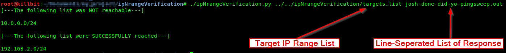
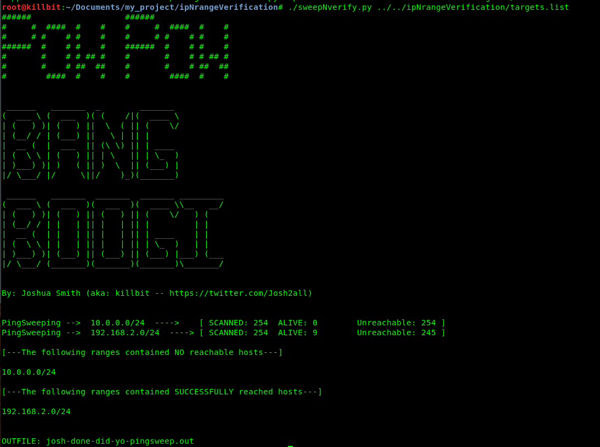

USE TOOLS AT YOUR OWN RISK, I AM IN NO WAY RESPONSIBLE FOR THE MISUSE OF THESE INSTRUCTIONS NOR THE TOOLS ITSELF (One of which leverages FPING -- https://github.com/shahifaqeer/fping).

These two tools were created by killbit follow me on twitter @josh2all (https://twitter.com/Josh2all).

Make sure you are hitting live hosts in each range you have been assigned.

# ipNrangeVerification.py
Are you tired of having to test if you have access to at least one IP address within a long list of IP ranges pointing at an excel doc with one hand and your fping or nmap scan out file with the other?

ipNrangeVerication solves this problem simply:
1. Create line seperated list of IP ranges 
2. Run fping command> for each in $(cat targets.list);do fping -a -g $each 2>/dev/null >> fping.out; done
3. ./ipNrangeVerification.py [FILE_OF_RANGES] [FILE_OF_UPHOSTS_FROM_FPING.OUT]

-- OR --

# sweepNverify.py (leverages FPING)
1. Create a line seperated list of IP Ranges
2. ./sweepNverify.py [TARGET_RANGES_LIST_FILE]

